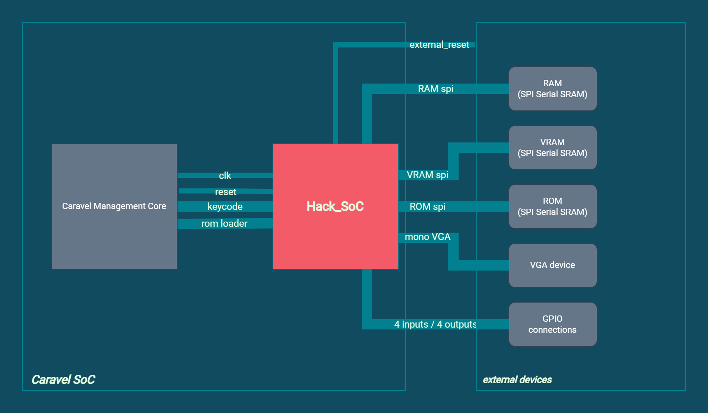

# mpw6_caravel_hacks_soc_bringup

## **MPW6 silicon test: Hack SoC project inside Caravel architecture**

---
### **Architecture overview:**

### **MPRJ_IO Connections:**

| |  | |  |
|---|---|---|---|
|HACK_EXTERNAL_RESET|input|MPRJ_IO[26]|connect to GND|
|DISPLAY_RGB |output|MPRJ_IO[29]|connector to Logic Analyzer or Scope|
|DISPLAY_HSYNC |output|MPRJ_IO[28]|connector to Logic Analyzer or Scope|
|DISPLAY_VSYNC |output|MPRJ_IO[27]|connector to Logic Analyzer or Scope|
|ROM_CS_N |output|MPRJ_IO[14]|connector to Logic Analyzer or Scope|
|ROM_CSK |output|MPRJ_IO[15]|connector to Logic Analyzer or Scope|
|RAM_CS_N |output|MPRJ_IO[8]|connector to Logic Analyzer or Scope|
|RAM_CSK |output|MPRJ_IO[9]|connector to Logic Analyzer or Scope|

---
